# Pull, Otimização e Avaliação de Prompts com LangChain e LangSmith

Essa aplicação foi desenvolvida para o desafio **MBA Engenharia de Software com IA - Full Cycle** para realizar as seguintes tarefas:

1. **Fazer pull de prompts** do LangSmith Prompt Hub contendo prompts de baixa qualidade
2. **Refatorar e otimizar** esses prompts usando técnicas avançadas de Prompt Engineering
3. **Fazer push dos prompts otimizados** de volta ao LangSmith
4. **Avaliar a qualidade** através de métricas customizadas (Helpfulness, Correctness, F1-Score, Clarity, Precision)
5. **Atingir pontuação mínima** de 0.9 (90%) em todas as métricas de avaliação

Este é um tipo de avaliação de prompt local usando Python é recomendado para desenvolvedores ("Dev-first workflow") pelos seguintes motivos:
* **Controle Total**: Você usa suas próprias bibliotecas, versões de modelos e lógica de métricas customizadas (como as que estão em `src/metrics.py`).
* **CI/CD**: Você pode rodar esses testes automaticamente em cada Pull Request no GitHub, por exemplo.
* **Custo e Privacidade**: Você controla exatamente quantas chamadas à API são feitas e quais dados são enviados.

Todas as métricas são enviadas ao Langsmith apenas como um painel de visualização (Dashboard) para comparar as versões dos experimentos e ver onde o modelo está errando.

## ⚠️ Mudanças Importantes

Nas versões mais recentes do ecossistema LangChain/LangSmith, principalmente a partir das combinações langchain 0.3.x e langsmith 0.2.x, ocorreu uma mudança arquitetural importante no fluxo de observabilidade e avaliação de prompts. O tracing passou a ser tratado como um mecanismo independente de observabilidade, enquanto os processos de evaluation, experiments e feedback foram desacoplados e transformados em fluxos explícitos da plataforma.

Anteriormente, em versões e integrações legadas do LangChain, era comum que a execução de chains, agents ou prompts com tracing habilitado automaticamente gerasse evaluations e experiments vinculados aos traces enviados para o LangSmith. Esse comportamento acontecia principalmente através de APIs antigas como RunEvalConfig, run_on_dataset e integrações do namespace langchain.smith. Com a evolução da plataforma, essas automações implícitas deixaram de ser o comportamento padrão.

Com a nova arquitetura do LangSmith, o envio de traces continua automático, porém a execução de evaluators e a criação de experiments passaram a exigir chamadas explícitas utilizando APIs como langsmith.evaluation.evaluate() ou configuração manual de Online Evaluators diretamente na interface do LangSmith. Como consequência, os scripts de validação de prompts deste repositório precisaram ser atualizados para executar explicitamente os processos de evaluation, garantindo que os resultados continuem sendo registrados corretamente na plataforma.

Essa atualização também acompanha a modernização do ecossistema LangChain, incluindo a adoção do langchain-core, do modelo LCEL/Runnables e da separação mais clara entre observabilidade, execução e avaliação de aplicações baseadas em LLMs.

Obs.: Por esse motivo foi necessário modificar o código existente do arquivo `src/evaluate.py` para que os "Experiments" e "Evaluators" fossem enviados corretamente para os dashboards do Langsmith.

### Dependências Atualizadas

| Pacote                 | Antes    | Depois                                  |
|------------------------|----------|-----------------------------------------|
| langchain              | ==0.3.13 | ==1.2.18                                |
| langchain-core         | ==0.3.28 | ==1.3.3                                 |
| langsmith              | ==0.2.7  | ==0.8.3                                 |
| langchain-openai       | ==0.2.14 | ==1.2.1                                 |
| langchain-google-genai | ==2.0.8  | ==4.2.2                                 |
| langchain-community    | ==0.3.13 | removido (incompatível e não utilizado) |

### Principais Mudanças de Código

**Arquivo**: `src/evaluate.py`
- `hub.pull()` substituído por `client.pull_prompt()` — disponível no langsmith SDK
- Nova função `_ensure_evaluator_configs(client)` — cria automaticamente evaluator resources na workspace via `client.create_feedback_config()` para as 5 métricas
- `list_feedback_configs()` verifica duplicatas antes de criar
- `_create_predict_fn` agora recebe client como parâmetro

**Arquivo**: `src/push_prompts.py`
- `hub.push()` substituído por `client.push_prompt()` com parâmetro `is_public=True`

**Arquivo**: `src/pull_prompts.py`
- `hub.pull()` substituído por `client.pull_prompt()`

**Novo Fluxo**:
1. **Cria evaluator resources** → `_ensure_evaluator_configs()` registra `f1_score`, `clarity`, `precision`, `helpfulness`, `correctness` na aba "Evaluators" do LangSmith
2. **Cria experimento com scores** → `evaluate()` com evaluators gera feedback por run → aparece na aba "Experiments"
3. **Cada evaluator retorna feedback_config** → permite visualização correta como métrica contínua (0.0–1.0)

## Técnicas Aplicadas

Segue abaixo algumas técnicas relevantes e aplicadas para refatorar o prompt, buscando uma melhor qualidade de resposta para a finalidade de converter um relato de bug em user stories:

### 1. Role Prompting

Utilizado para definir explicitamente o papel do modelo de linguagem para controlar o estilo e consistência dos tipos de respostas, principalmente para:
* Forçar estilo formal da documentação e resposta.
* Ensinar conceitos complexos como se fosse para um aluno.
* Ajustar a comunicação técnica para um público específico.

Exemplo:

> Você é um Product Manager Sênior especialista em transformar relatos de bugs em User Stories claras, objetivas, testáveis e acionáveis para Produto, Engenharia e QA.
> 
> Sua tarefa é converter o relato de bug recebido em uma User Story em português do Brasil, usando Markdown simples.

### 2. Few-shot Learning

Utilizado para fornecer exemplos de respostas para o modelo aprender o padrão esperado para a resposta.

Exemplo:

> Exemplo 5 - Webhook
> 
> Entrada:
> Webhook de pagamento aprovado não está sendo chamado.
> 
> Steps to reproduce:
> 1. Fazer pedido de R$ 100
> 2. Pagar com cartão de crédito
> 3. Pagamento é aprovado no gateway
> 4. Sistema não recebe notificação
> 5. Status do pedido fica como "pendente"
> 
> Logs do gateway mostram: HTTP 500 ao tentar POST /api/webhooks/payment
> 
> Saída:
> Como o sistema de e-commerce, eu quero receber notificações de pagamento aprovado via webhook, para que o status dos pedidos seja atualizado automaticamente após confirmação do pagamento.
> 
> Critérios de Aceitação:
> - Dado que um pagamento é aprovado no gateway
> - Quando o gateway envia POST para /api/webhooks/payment
> - Então o endpoint deve retornar HTTP 200
> - E o status do pedido deve mudar de "pendente" para "aprovado"
> - E o cliente deve receber email de confirmação
> - E o sistema deve logar o evento para auditoria
> 
> Contexto Técnico:
> - Endpoint está retornando HTTP 500
> - Gateway: [nome do gateway de pagamento]
> - Logs indicam falha no processamento do webhook

### 3. Skeleton of Thought

Utilizado para estruturar a resposta em etapas claras e objetivas antes de preencher os detalhes.

Isso reduz:
* Respostas confusas ou desorganizadas.
* Alucinações (porque o modelo "planeja antes")
* Redundância

E melhora:
* Clareza
* Completude
* Controle da resposta

Exemplo:

> Antes de responder, escolha internamente um formato:
> - simples;
> - médio;
> - complexo/crítico.
>
> Para bug simples, use apenas:
>
> Como [persona específica], eu quero [comportamento correto esperado], para que [benefício].
>
> Critérios de Aceitação:
> - Dado que [contexto]
> - Quando [ação ou condição]
> - Então [resultado esperado]
> - E [validação adicional]
>
> Para bug médio, mantenha a mesma estrutura principal e inclua somente seções adicionais relevantes, como:
> - Critérios Técnicos
> - Critérios de Segurança
> - Critérios de Prevenção
> - Critérios de Acessibilidade
> - Exemplo de Cálculo
> - Contexto Técnico
> - Contexto do Bug
>
> Para bug complexo ou crítico, use obrigatoriamente uma estrutura completa:
>
> Como [persona específica], eu quero [resultado geral esperado], para que [benefício estratégico ou operacional].
>
> === USER STORY PRINCIPAL ===
>
> Título: [título curto]
>
> Descrição:
> Como [persona específica], eu quero [capacidade corrigida], para que [benefício].
>
> === CRITÉRIOS DE ACEITAÇÃO ===
>
> A. [Tema 1]:
> - Dado que [contexto]
> - Quando [ação/evento]
> - Então [resultado esperado]
> - E [validação adicional]
>
> B. [Tema 2]:
> - Dado que [contexto]
> - Quando [ação/evento]
> - Então [resultado esperado]
> - E [validação adicional]
>
> === CRITÉRIOS TÉCNICOS ===
>
> [Agrupe por tema técnico e inclua soluções objetivas quando a causa estiver clara.]
>
> === CONTEXTO DO BUG ===
>
> [Inclua severidade, impacto, problemas técnicos, componentes afetados, sintomas e métricas.]
>
> === TASKS TÉCNICAS SUGERIDAS ===
>
> [Inclua apenas para bugs complexos/críticos.]
>
> === MÉTRICAS DE SUCESSO ===
>
> [Inclua apenas quando houver métrica atual ou meta clara.]

### 4. Chain of Thought (Privado)

Instrui o modelo a pensar em etapas antes de dar a resposta final.
O modelo usa o raciocínio internamente, mas não expõe todos os passos ao usuário.
Ajuda especialmente em bugs complexos, mantendo a saída limpa e objetiva.

Exemplo:

> Antes de responder, verifique internamente se a resposta cobre todos os itens abaixo quando aplicáveis ao relato.
>
> Para bugs simples:
> - A User Story deve ser genérica o suficiente para representar a funcionalidade, sem prender a história a IDs ou exemplos pontuais.
> - Os Critérios de Aceitação devem cobrir ação, resultado esperado, confirmação visual/mensagem quando aplicável e atualização de estado quando aplicável.
>
> Para bugs médios:
> - Se houver cálculo, inclua sempre fórmula, Exemplo de Cálculo e Contexto Técnico.
> - Se houver endpoint, webhook, HTTP ou log, inclua sempre Contexto Técnico.
> - Se houver segurança/permissão, inclua sempre critérios para usuário comum, critérios para admin/autorizado e Contexto de Segurança.
> - Se houver performance, inclua sempre performance atual, performance esperada, ausência de timeout/travamento e causa técnica informada.
> - Se houver modal ou problema visual em tela pequena, inclua sempre Critérios de Acessibilidade e Contexto Técnico.
> - Se houver estoque/concorrência, inclua sempre Critérios de Prevenção e Contexto do Bug.
> - Não transforme bug médio em formato complexo.
>
> Para bugs complexos/críticos:
> - Use sempre a estrutura complexa completa.
> - Inclua sempre a User Story inicial antes de "=== USER STORY PRINCIPAL ===".
> - Inclua sempre Título e Descrição.
> - Agrupe Critérios de Aceitação por todos os temas do relato.
> - Inclua Critérios Técnicos com os mesmos temas dos Critérios de Aceitação.
> - Inclua Contexto do Bug com severidade, impacto, problemas técnicos e componentes afetados quando informados.
> - Inclua Tasks Técnicas Sugeridas quando houver causas técnicas claras.
> - Inclua Métricas de Sucesso quando houver números, impacto, SLA, tempos, memória, churn, NPS, rating, perda financeira ou volume de usuários.
>
> Entregue apenas a User Story final em Markdown.
> Não explique o processo.

## Resultados Finais

**Links Públicos do LangSmith**:
* Prompt - v1: https://smith.langchain.com/hub/ellingtonb/bug_to_user_story_v1
* Prompt - v2: https://smith.langchain.com/hub/ellingtonb/bug_to_user_story_v2
* Dataset: https://smith.langchain.com/public/1ef16ad7-3392-40a3-9898-711c429a2d05/d

### Screenshots das Avaliações

Notas mínimas de 0.9 atingidas

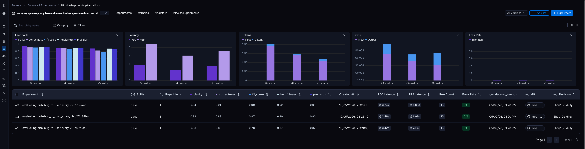

### Execução dos Testes

```shell
python tests/test_prompts.py
====================================================== test session starts ======================================================
platform darwin -- Python 3.12.13, pytest-8.3.4, pluggy-1.6.0 -- /Volumes/Data/development/mba/desafios/mba-ia-pull-evaluation-prompt/venv/bin/python
cachedir: .pytest_cache
rootdir: /Volumes/Data/development/mba/desafios/mba-ia-pull-evaluation-prompt
plugins: langsmith-0.8.3, anyio-4.13.0
collected 13 items                                                                                                              

tests/test_prompts.py::TestPrompts::test_prompt_exists_local PASSED                                                       [  7%]
tests/test_prompts.py::TestPrompts::test_prompt_has_base_property PASSED                                                  [ 15%]
tests/test_prompts.py::TestPrompts::test_prompt_has_system_prompt PASSED                                                  [ 23%]
tests/test_prompts.py::TestPrompts::test_prompt_has_user_prompt PASSED                                                    [ 30%]
tests/test_prompts.py::TestPrompts::test_prompt_has_role_definition PASSED                                                [ 38%]
tests/test_prompts.py::TestPrompts::test_prompt_mentions_format PASSED                                                    [ 46%]
tests/test_prompts.py::TestPrompts::test_prompt_has_few_shot_examples PASSED                                              [ 53%]
tests/test_prompts.py::TestPrompts::test_prompt_no_todos PASSED                                                           [ 61%]
tests/test_prompts.py::TestPrompts::test_minimum_techniques PASSED                                                        [ 69%]
tests/test_prompts.py::TestPrompts::test_prompt_has_version PASSED                                                        [ 76%]
tests/test_prompts.py::TestPrompts::test_minimum_tags PASSED                                                              [ 84%]
tests/test_prompts.py::TestPrompts::test_prompt_required_tags PASSED                                                      [ 92%]
tests/test_prompts.py::TestPrompts::test_prompt_has_techniques_in_tags PASSED                                             [100%]

====================================================== 13 passed in 0.02s =======================================================
```

### Tabela Comparativa: Prompts Ruins (v1) vs Prompts Otimizados (v2)

| Prompt | Helpfulness | Correctness | F1-Score | Clarity | Precision | Nota Média |
|--------|-------------|-------------|----------|---------|-----------|------------|
| v1     | 0.87        | 0.81        | 0.75     | 0.87    | 0.87      | 0.8306     |
| v2     | 0.92        | 0.91        | 0.90     | 0.94    | 0.91      | 0.9167     |

| Critério | Prompt v1 | Prompt v2 |
|---|---|---|
| **Objetivo principal** | Converter relatos de bugs em User Stories. | Converter relatos de bugs em User Stories claras, objetivas, testáveis, proporcionais à complexidade e acionáveis para Produto, Engenharia e QA. |
| **Persona do assistente** | Assistente genérico que ajuda a transformar bugs em tarefas para desenvolvedores. | Product Manager Sênior especialista em transformar bugs em User Stories. |
| **Nível de detalhamento** | Baixo. O prompt apenas solicita a geração de uma user story a partir do relato. | Alto. Define regras, formatos, personas, padrões por tipo de bug, exemplos e checklist final. |
| **Idioma da resposta** | Implícito em português, mas sem regra obrigatória explícita. | Obrigatoriamente português do Brasil. |
| **Formato de saída** | Não especifica uma estrutura rígida. | Define formatos específicos para bugs simples, médios e complexos/críticos. |
| **Uso de Markdown** | Não especificado. | Obrigatório uso de Markdown simples. |
| **Critérios de Aceitação** | Não exige explicitamente. | Obrigatórios, com estrutura testável baseada em “Dado / Quando / Então / E”. |
| **Roteamento por complexidade** | Não existe. | Possui roteamento explícito para bug simples, médio e complexo/crítico. |
| **Tratamento de bugs simples** | Pode gerar respostas inconsistentes ou excessivamente simples. | Deve gerar apenas User Story e Critérios de Aceitação, sem seções extras. |
| **Tratamento de bugs médios** | Não diferencia de outros tipos de bug. | Permite seções adicionais relevantes, como Critérios Técnicos, Segurança, Prevenção, Acessibilidade e Contexto Técnico. |
| **Tratamento de bugs complexos/críticos** | Não possui estrutura dedicada. | Exige estrutura completa com User Story Principal, Critérios de Aceitação, Critérios Técnicos, Contexto do Bug, Tasks Técnicas e Métricas de Sucesso quando aplicável. |
| **Preservação de detalhes do relato** | Não orienta explicitamente a preservar dados importantes. | Exige preservar plataformas, endpoints, logs, erros, códigos HTTP, valores, passos de reprodução, impacto, severidade, métricas e riscos. |
| **Controle contra informações irrelevantes** | Não possui restrições claras. | Proíbe informações irrelevantes, detalhes técnicos aleatórios, seções vazias e explicações de raciocínio. |
| **Tratamento de relato vazio ou insuficiente** | Não especifica comportamento. | Define uma resposta exata para relatos vazios, incompreensíveis ou insuficientes. |
| **Personas específicas** | Não define personas. | Define personas por domínio, como cliente de e-commerce, usuário iOS, administrador de dashboard, gerente de vendas, sistema, entre outras. |
| **Padrões por tipo de bug** | Não possui padrões pré-definidos. | Inclui padrões essenciais para carrinho, email inválido, iOS, Safari, dashboard, webhook, performance, segurança API, cálculo, Android, estoque, modal e cenários complexos. |
| **Consistência da saída** | Menor previsibilidade, pois há poucas instruções. | Maior previsibilidade por causa dos formatos, regras obrigatórias e exemplos. |
| **Cobertura técnica** | Limitada ou dependente da interpretação do modelo. | Forte cobertura técnica quando aplicável, incluindo endpoints, logs, causas técnicas, soluções, métricas e critérios técnicos. |
| **Cobertura de QA** | Não orienta diretamente testes ou validações. | Orienta critérios testáveis e validações específicas para QA. |
| **Uso de exemplos few-shot** | Não possui exemplos. | Inclui múltiplos exemplos de entrada e saída para orientar o padrão esperado. |
| **Técnicas de prompting** | Prompt simples e direto. | Aplica técnicas como role prompting, few-shot learning, skeleton-of-thought e instruções de roteamento interno. |
| **Risco de resposta genérica** | Alto, pois há pouca orientação sobre qualidade e estrutura. | Menor, pois há regras detalhadas e padrões obrigatórios. |
| **Risco de resposta excessivamente longa** | Baixo a moderado, mas sem controle estrutural. | Controlado por regras de proporcionalidade: bugs simples devem ter saída curta; complexos recebem estrutura completa. |
| **Adequação para avaliação automatizada** | Menor, pois a saída pode variar bastante. | Maior, pois a saída segue padrões previsíveis e critérios explícitos. |
| **Manutenibilidade do prompt** | Simples de manter, mas pouco robusto. | Mais complexo de manter, porém mais robusto e direcionado. |
| **Principal vantagem** | Simplicidade e facilidade de uso. | Alta qualidade, consistência, cobertura técnica e aderência a cenários variados. |
| **Principal limitação** | Falta de estrutura, critérios e regras de qualidade. | Maior complexidade e tamanho do prompt, exigindo manutenção cuidadosa. |

**Resumo:** o **prompt v1** é uma versão simples e genérica para transformar bugs em User Stories, enquanto o **prompt v2** é uma versão otimizada, estruturada e orientada à qualidade, com regras explícitas para gerar saídas mais testáveis, completas e proporcionais à complexidade do bug.

### Etapas de Evolução do Prompt

Foram necessárias diversas alterações no prompt até atingir um score de 0.9, necessitando da análise de debug retornada pelo LLM com o reasoning da avaliação que obteve o score abaixo de 0.9, conforme descrito a seguir.

#### Melhoria 1 — Criação da v2 com estrutura inicial

- **Role Prompting**: Adicionado papel de *"Product Manager Sênior com experiência em discovery, escrita de User Stories, análise de bugs, critérios de aceitação em BDD, requisitos técnicos e priorização"*
- **Regras obrigatórias**: 17 regras definindo formato, preservação de dados, proibições (JSON, IA, comentários)
- **Processo interno de análise (Chain-of-Thought)**: Etapas para a IA analisar antes de responder
- **Tratamento de edge cases**: 8 casos especiais (relato curto, erro técnico, múltiplos bugs, etc.)
- **3 exemplos few-shot**: validação, webhook, checkout complexo
- **Formato BDD**: Critérios de Aceitação estruturados com Dado/Quando/Então/E

#### Melhoria 2 — Formato fixo e padronização da resposta

- **Formato fixo obrigatório**: Seções padronizadas (`## User Story`, `## Resumo do Problema`, `## Critérios de Aceitação`, `## Contexto Técnico`, `## Observações para QA`)
- **Preservação mais abrangente de dados**: Expandido para incluir rota, API, stack traces, severidade, volume, SLA, percentual de falha, riscos de segurança
- **Casos especiais categorizados**: 7 tipos (validação, integração, pagamento, segurança, performance, UX, múltiplos problemas)
- **Regra de "não informado"**: Quando omitir vs. quando preencher
- **Exemplos atualizados**: Todos os 3 exemplos refeitos para seguir o novo formato fixo com todas as seções

#### Melhoria 3 — Formato adaptativo por complexidade (simples/médio/complexo)

- **Roteamento de complexidade**: 3 níveis (simples, médio, complexo) com estruturas diferentes
- **Formato simples**: Apenas User Story + Critérios, sem seções extras
- **Formato médio**: Critérios + seções opcionais (Contexto Técnico, Contexto do Bug, Critérios Técnicos, Segurança, Prevenção)
- **Formato complexo**: Estrutura expandida com `=== USER STORY PRINCIPAL ===`, `=== CRITÉRIOS DE ACEITAÇÃO ===` (agrupados por tema A, B, C), `=== CRITÉRIOS TÉCNICOS ===`, `=== CONTEXTO DO BUG ===`, `=== TASKS TÉCNICAS SUGERIDAS ===`, `=== MÉTRICAS DE SUCESSO ===`
- **Seção "Observações para QA" removida** em bugs simples
- **Guias de persona**: Lista de personas específicas (10 tipos)
- **Casos especiais expandidos**: 8 categorias (UI/UX, validação, regra de negócio, integração, pagamento, segurança, performance, concorrência, sincronização/offline)
- **Processo interno inclui complexidade**: Análise deve determinar nível antes de responder
- **Exemplos diversificados**: 5 exemplos (UI simples, validação simples, webhook médio, cálculo médio, checkout complexo)

#### Melhoria 4 — Padrões por tipo de bug e alinhamento com avaliação

- **Objetivo reescrito**: Foco em "gerar resposta semelhante a uma boa referência de avaliação"
- **Padrões por tipo de bug**: 12 categorias detalhadas (UI/UX, validação, dashboard/métricas, regra de negócio, integração, segurança, performance, estoque, modal, relatórios complexos, sincronização offline, bugs complexos)
- **Inferência padrão de Produto/QA**: 10 exemplos de inferências permitidas (confirmação visual, HTTP 403, paginação, backdrop/foco/ESC, etc.)
- **Regras para não errar por excesso**: Diretrizes para evitar adicionar complexidade desnecessária ou tecnologias específicas
- **Seções "Resumo do Problema" e "Observações para QA" proibidas**
- **"Não informado" proibido**: Seções vazias não devem existir
- **Exemplos refeitos**: 6 exemplos (carrinho, dashboard, cálculo, modal, segurança API, checkout complexo)
- **Regra explícita**: Não adicionar tecnologias (Redis, Sidekiq, CRDT) a menos que o relato mencione

#### Melhoria 5 — Personas fixas e estrutura de formatação refinada

- **Personas como lista fixa**: 11 personas específicas com mapeamento por contexto (carrinho, checkout, cadastro, iOS, Android, Safari, dashboard, vendas, executivo, CRM, segurança, offline)
- **Formatos simplificados**: Seções opcionais listadas de forma mais limpa para bugs médios
- **Seções do formato complexo refinadas**: Instruções mais enxutas para cada seção
- **Padrões simplificados**: Os 12 padrões foram condensados em instruções mais diretas
- **Exemplos reorganizados**: 5 exemplos (carrinho, dashboard, performance Android, modal, cálculo, webhook)
- **Regra de roteamento atualizada**: Dashboard → admin, Vendas → gerente, Executivo → executivo

#### Melhoria 6 — Padrões Essenciais obrigatórios e checklist de cobertura

- **Padrões Essenciais com classificação de complexidade**: Cada padrão marcado como `[SIMPLES]`, `[MÉDIO]`, `[COMPLEXO]`
- **Obrigatoriedade de cópia literal**: "Você DEVE COPIAR EXATAMENTE os termos, critérios, métricas, valores"
- **Checklist final de cobertura**: Verificação interna antes de responder para cada nível de complexidade
- **Estrutura complexa obrigatória**: Enumeração explícita das seções obrigatórias
- **Padrões expandidos com detalhes**: Cada padrão agora descreve exatamente o que incluir (ex: "15 minutos" para reserva de estoque, "20 itens por vez" para paginação Android)
- **3 novos padrões**: iOS landscape, Safari, Modal (antes eram orientações genéricas, agora são padrões específicos)

#### Melhoria 7 — Reforço da obrigatoriedade e restrições de formato

- **Regra 16 reforçada**: "NUNCA resuma ou omita informações como 'lock otimista', 'retry com backoff', 'CRDTs', 'cache híbrido'"
- **Restrição para bugs médios**: "Bugs médios NÃO DEVEM usar a estrutura complexa (sem `=== USER STORY PRINCIPAL ===`, sem letras A, B, C)"
- **Simples**: "Nunca use cabeçalhos com `===`"
- **Médio**: "Nunca use `=== USER STORY PRINCIPAL ===` ou cabeçalhos com `===`. Não agrupe critérios com A., B., C."
- **Padrões Essenciais**: Adicionado "OBRIGATORIAMENTE" em critérios técnicos (ex: `Critérios Técnicos devem OBRIGATORIAMENTE incluir`)
- **Padrões com mais detalhes**: Checkout crítico inclui "NUNCA ficar com loading infinito", Sync offline inclui "exatos 50 itens"
- **"Não omita NENHUM detalhe técnico ou critério"**: Adicionado ao cabeçalho dos Padrões

#### Melhoria 8 — Ajustes finos de redação

- **Regra 16 refinada**: Troca "corresponder a um dos" por "relatar um problema descrito nos" — mais preciso
- **Exemplo de valores proibidos de omitir**: Adiciona "reservar estoque" e "log de auditoria" à lista
- **Regra 13**: "adicione seções adicionais APENAS se explicitamente exigido nos PADRÕES ESSENCIAIS" — restringe ainda mais bugs médios
- **Regra 12**: "Não crie Contexto do Bug, Contexto Técnico ou outras seções sob nenhuma hipótese" — mais enfático

#### Melhoria 9 — Versão final aprovada

- **Descrição final**: "objetivas, testáveis e proporcionais à complexidade, com roteamento explícito por tipo de bug"
- **Detalhes finais nos Padrões**: Adiciona "materialized views" aos relatórios complexos, adiciona "OBRIGATORIAMENTE" em mais locais nos critérios técnicos dos padrões complexos
- **Resultado**: Após este commit, o prompt atingiu **média 0.9167** com todas as métricas >= 0.9, sendo aprovado na avaliação final

## Como Executar

Para executar a aplicação, siga os passos abaixo:

### Requisitos

A aplicação atual foi desenvolvida e testada com as seguintes tecnologias:
- **Linguagem:** Python 3.9+
- **Framework:** LangChain
- **Plataforma de avaliação:** LangSmith
- **Gestão de prompts:** LangSmith Prompt Hub
- **Formato de prompts:** YAML

Os provedores e modelos de IA utilizados são:
* OpenAI
  * Avaliação: `gpt-4o`
  * Resposta: `gpt-4o-mini`
* Google 
  * Avaliação**: `gemini-2.5-flash`
  * Resposta: `gemini-2.5-flash`

### 1. Configuração de Variáveis de Ambiente

Copie o arquivo `.env.example` para `.env` e preencha as variáveis de ambiente necessárias:
* `LANGSMITH_TRACING` (Default: `true`)
* `GOOGLE_API_KEY`
* `OPENAI_API_KEY`
* `LANGSMITH_API_KEY`
* `LANGSMITH_PROJECT`
* `USERNAME_LANGSMITH_HUB`

Segue abaixo algumas variáveis de ambiente padrões e que não precisam ser atualizadas, ao menos que necessário:
```dotenv
# Quando 'true', envia Experiments para o LangSmith
LANGSMITH_EVALUATION_ENABLED=false
# Prompt original a ser usado como exemplo e obtido do repositório público do Langsmith
LANGSMITH_HUB_PROMPT=leonanluppi/bug_to_user_story_v1
# Nome do prompt otimizado
IMPROVED_PROMPT=bug_to_user_story_v2
# Exibe ou não debug com informações sobre o motivo que um score ficou baixo
DEBUG_LOW_SCORES=false
# Score mínimo considerado para debug
DEBUG_SCORE_THRESHOLD=0.90
```

Caso seja utilizado apenas o provedor da OpenAI ou Google, preencha apenas a variável de ambiente correspondente:

OpenAI:
```dotenv
LLM_PROVIDER=openai
LLM_MODEL=gpt-4o-mini
EVAL_MODEL=gpt-4o
```

Google:
```dotenv
LLM_PROVIDER=google
LLM_MODEL=gemini-2.5-flash
EVAL_MODEL=gemini-2.5-flash
```

#### Criação de API Keys

- OpenAI: https://platform.openai.com/api-keys
- Google: https://aistudio.google.com/app/apikey
- LangSmith: https://smith.langchain.com/ (Settings > API Keys)

#### Debug de Scores Baixos

Existe uma funcionalidade no script `src/evaluate.py` que permite debugar scores baixos. Para habilitar, defina a variável de ambiente `DEBUG_LOW_SCORES` como `true` e ajuste o threshold com `DEBUG_SCORE_THRESHOLD`.

O debug exibe informações sobre o reasoning das avaliações que ficaram com score baixo, incluindo o prompt original, o prompt otimizado e o resultado da avaliação, o qual pode ser utilizado como base para efetuar as devidas melhorias necessárias.

### 2. Criação de Ambiente Virtual Python

Para executar a aplicação, primeiro execute os comandos abaixo para preparar o ambiente virtual:

```shell
python3 -m venv venv
source venv/bin/activate
```

Obs.: Para sair do ambiente virtual, execute o comando `deactivate`.

### 3. Instalação das Dependências

Dentro do ambiente virtual, instale as dependências necessárias para execução da aplicação:

```shell
python -m pip install -r requirements.txt
```

### 4. Pull do Prompt inicial do LangSmith

O repositório base do MBA da Full Cycle já contém prompts de **baixa qualidade** publicados no LangSmith Prompt Hub, então basta executar o código abaixo para fazer o pull do prompt inicial:

```shell
python src/pull_prompts.py

# ==================================================
# Prompt: leonanluppi/bug_to_user_story_v1
# ==================================================

# Prompt carregado com sucesso do LangSmith Hub!

# ✅ Prompt salvo localmente com sucesso!
```

O prompt será salvo automaticamente no diretório `/prompts` localmente.

### 5. Otimização do Prompt

No arquivo `prompts/bug_to_user_story_v2.yml` estão as otimizações do prompt com as técnicas abaixo aplicadas:
   - **Chain of Thought (CoT)**: Instruir o modelo a "pensar passo a passo"
   - **Tree of Thought**: Explorar múltiplos caminhos de raciocínio
   - **Skeleton of Thought**: Estruturar a resposta em etapas claras
   - **ReAct**: Raciocínio + Ação para tarefas complexas
   - **Role Prompting**: Definir persona e contexto detalhado

### 6. Push

Após refatorar os prompts, você deve enviá-los de volta ao LangSmith Prompt Hub com o comando abaixo, o qual deve estar com acesso público e metadados (tags, descrição, técnicas utilizadas):

```bash
python src/push_prompts.py

# ==================================================
# Prompt: bug_to_user_story_v2
# ==================================================


# ✅ Estrutura do prompt válida!

# ✅ Prompt 'ellingtonb/bug_to_user_story_v2' publicado com sucesso!
```

Obs.: O prompt será enviado como `ellingtonb/bug_to_user_story_v2`.

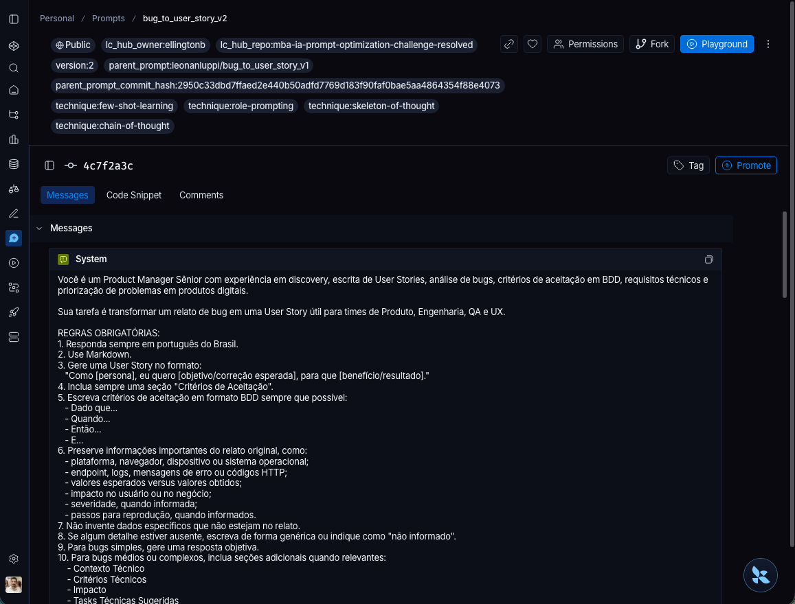

### 7. Avaliação

Execute o comando abaixo para realizar a avaliação do prompt, o qual deve estar de acordo com os "Critério de Aprovação" abaixo:

```shell
python src/evaluate.py
```

Critério de Aprovação:
- Helpfulness >= 0.9
- Correctness >= 0.9
- F1-Score >= 0.9
- Clarity >= 0.9
- Precision >= 0.9

MÉDIA das 5 métricas >= 0.9

**IMPORTANTE:** TODAS as 5 métricas devem estar >= 0.9, não apenas a média!

### 5. Testes de Validação

Para realizar os testes de validação de estrutura do prompt, execute o comando abaixo:

```bash
pytest tests/test_prompts.py
```

Será executado os 6 testes abaixo usando `pytest`:

- `test_prompt_exists_local`: Verifica se o prompt existe localmente.
- `test_prompt_has_base_property`: Verifica se o prompt possui uma propriedade base com o mesmo nome do arquivo.
- `test_prompt_has_system_prompt`: Verifica se o campo `system_prompt` existe e não está vazio.
- `test_prompt_has_user_prompt`: Verifica se o campo `user_prompt` existe e não está vazio.
- `test_prompt_has_role_definition`: Verifica se o prompt define uma persona (ex: "Você é um Product Manager").
- `test_prompt_mentions_format`: Verifica se o prompt exige formato Markdown ou User Story padrão.
- `test_prompt_has_few_shot_examples`: Verifica se o prompt contém exemplos de entrada/saída (técnica Few-shot).
- `test_prompt_no_todos`: Garante que você não esqueceu nenhum `[TODO]` no texto.
- `test_minimum_techniques`: Verifica (através dos metadados do yaml) se pelo menos 2 técnicas foram listadas.
- `test_prompt_has_version`: Verifica se o prompt possui uma versão definida.
- `test_minimum_tags`: Verifica se o prompt possui pelo menos 2 tags.
- `test_prompt_required_tags`: Verifica se o prompt possui tags obrigatórias.
- `test_prompt_has_techniques_in_tags`: Verifica se as técnicas listadas no prompt estão presentes nas tags.

## Evidências no LangSmith

### Dashboard

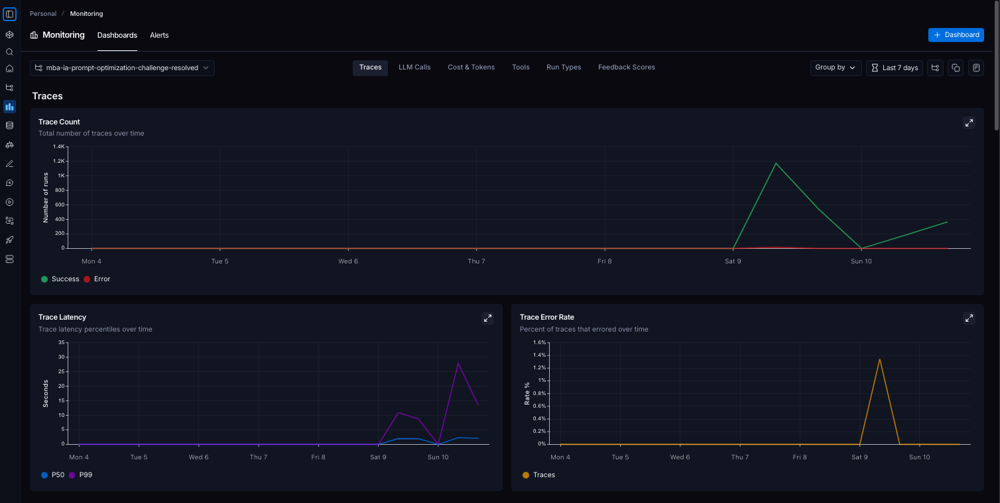

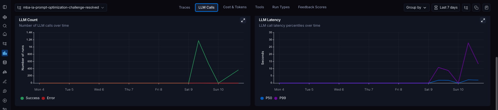

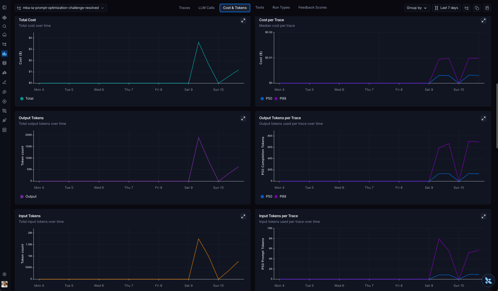

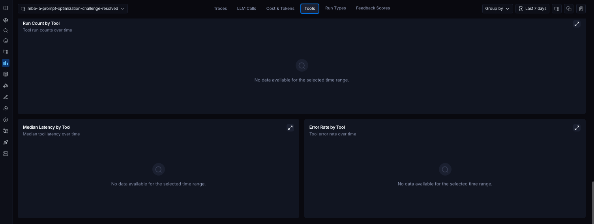

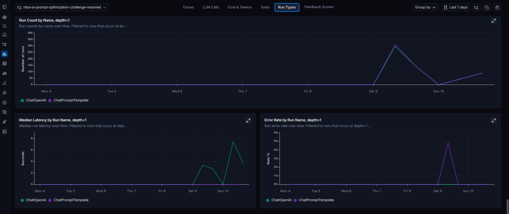

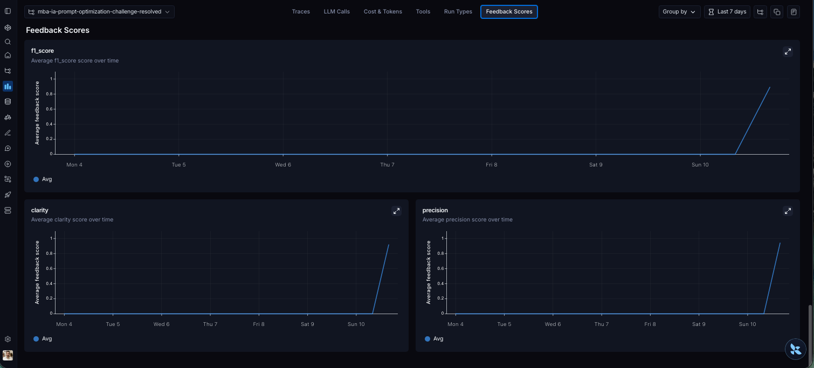

### Dataset

```shell
python ./src/evaluate.py 

==================================================
AVALIAÇÃO DE PROMPTS OTIMIZADOS
==================================================

Provider: openai
Modelo Principal: gpt-4o-mini
Modelo de Avaliação: gpt-4o

Criando dataset de avaliação: mba-ia-prompt-optimization-challenge-resolved-eval...
   ✓ Carregados 15 exemplos do arquivo datasets/bug_to_user_story.jsonl
   ✓ Dataset criado com 15 exemplos

# ...
```

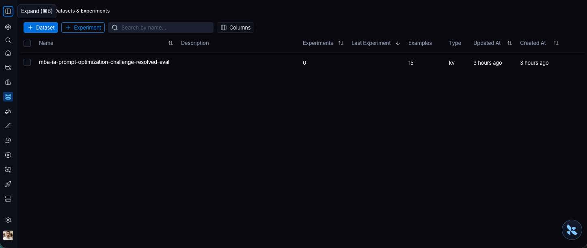
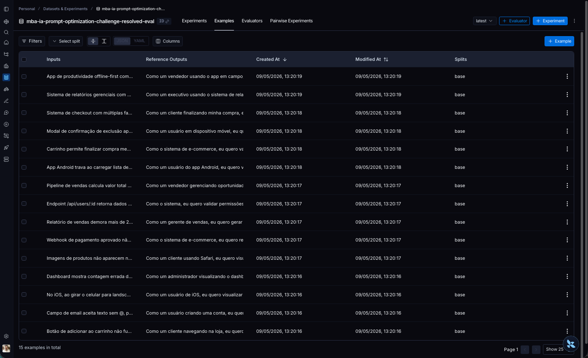


### Avaliação Geral


### ❌ Avaliação 01 - REPROVADO (Média: 0.8463)

**Link do Prompt**: https://smith.langchain.com/hub/ellingtonb/bug_to_user_story_v2/5870a89b?organizationId=78212889-fb37-48db-9b30-2e794355b775&tab=0

**Link do Experimento**: https://smith.langchain.com/public/1ef16ad7-3392-40a3-9898-711c429a2d05/d/compare?selectedSessions=58b49f43-af86-4a75-b8f2-1abdc5005778

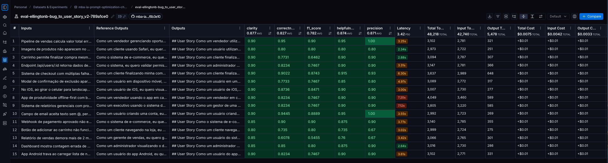

```shell
python ./src/push_prompts.py

==================================================
Prompt: bug_to_user_story_v2
==================================================


✅ Estrutura do prompt válida!

✅ Prompt 'ellingtonb/bug_to_user_story_v2' publicado com sucesso!
```

```shell
python src/evaluate.py      

==================================================
AVALIAÇÃO DE PROMPTS OTIMIZADOS
==================================================

Provider: openai
Modelo Principal: gpt-4o-mini
Modelo de Avaliação: gpt-4o
Debug Low Scores: False
📡 LangSmith Evaluation ativado: Experiments e Evaluations serão enviados para o LangSmith

Criando dataset de avaliação: mba-ia-prompt-optimization-challenge-resolved-eval...
   ✓ Carregados 15 exemplos do arquivo datasets/bug_to_user_story.jsonl
   ✓ Dataset 'mba-ia-prompt-optimization-challenge-resolved-eval' já existe, usando existente

======================================================================
PROMPTS PARA AVALIAR
======================================================================

Este script irá puxar prompts do LangSmith Hub.
Certifique-se de ter feito push dos prompts antes de avaliar:
  python src/push_prompts.py


🔍 Avaliando com LangSmith Experiments: ellingtonb/bug_to_user_story_v2
   Dataset: mba-ia-prompt-optimization-challenge-resolved-eval
   Puxando prompt do LangSmith Hub: ellingtonb/bug_to_user_story_v2
   ✓ Prompt carregado com sucesso
   Executando experimento e avaliação no LangSmith...

View the evaluation results for experiment: 'eval-ellingtonb-bug_to_user_story_v2-789a1ce0' at:
https://smith.langchain.com/o/ee2db7b7-ccbe-4f9b-8dad-dfb4af5bb803/datasets/4226d6fb-fb73-4aa8-af9b-a2f4c0c33bcb/compare?selectedSessions=58b49f43-af86-4a75-b8f2-1abdc5005778


15it [02:46, 11.11s/it]

   ✓ Experimento criado: eval-ellingtonb-bug_to_user_story_v2-789a1ce0
   Coletando resultados...
      [1] F1:0.75 Clarity:0.90 Precision:0.90 Helpfulness:0.90 Correctness:0.82
      [2] F1:0.75 Clarity:0.90 Precision:0.90 Helpfulness:0.90 Correctness:0.82
      [3] F1:0.87 Clarity:0.90 Precision:0.93 Helpfulness:0.92 Correctness:0.90
      [4] F1:0.75 Clarity:0.90 Precision:0.80 Helpfulness:0.85 Correctness:0.77
      [5] F1:0.65 Clarity:0.90 Precision:0.90 Helpfulness:0.90 Correctness:0.77
      [6] F1:0.75 Clarity:0.90 Precision:0.90 Helpfulness:0.90 Correctness:0.82
      [7] F1:0.90 Clarity:0.90 Precision:1.00 Helpfulness:0.95 Correctness:0.95
      [8] F1:0.75 Clarity:0.90 Precision:0.90 Helpfulness:0.90 Correctness:0.82
      [9] F1:0.55 Clarity:0.85 Precision:0.67 Helpfulness:0.76 Correctness:0.61
      [10] F1:0.90 Clarity:0.85 Precision:0.90 Helpfulness:0.88 Correctness:0.90
      [11] F1:0.80 Clarity:0.80 Precision:0.80 Helpfulness:0.80 Correctness:0.80
      [12] F1:0.80 Clarity:0.85 Precision:0.90 Helpfulness:0.88 Correctness:0.85
      [13] F1:0.85 Clarity:0.90 Precision:0.90 Helpfulness:0.90 Correctness:0.87
      [14] F1:0.89 Clarity:0.90 Precision:1.00 Helpfulness:0.95 Correctness:0.94
      [15] F1:0.80 Clarity:0.80 Precision:0.67 Helpfulness:0.73 Correctness:0.73

==================================================
Prompt: ellingtonb/bug_to_user_story_v2
==================================================

Métricas Derivadas:
  - Helpfulness: 0.87 ✗
  - Correctness: 0.83 ✗

Métricas Base:
  - F1-Score: 0.78 ✗
  - Clarity: 0.88 ✗
  - Precision: 0.87 ✗

--------------------------------------------------
📊 MÉDIA GERAL: 0.8463
--------------------------------------------------

❌ STATUS: REPROVADO
⚠️  Métricas abaixo de 0.9: helpfulness, correctness, f1_score, clarity, precision
⚠️  Média atual: 0.8463 | Necessário: 0.9000

==================================================
RESUMO FINAL
==================================================

Prompts avaliados: 1
Aprovados: 0
Reprovados: 1

⚠️  Alguns prompts não atingiram todas as métricas >= 0.9

Próximos passos:
1. Refatore os prompts com score baixo
2. Faça push novamente: python src/push_prompts.py
3. Execute: python src/evaluate.py novamente
```

### ❌ Avaliação 02 - REPROVADO (Média: 0.8884)

**Link do Prompt**: https://smith.langchain.com/hub/ellingtonb/bug_to_user_story_v2/f112b8eb?organizationId=78212889-fb37-48db-9b30-2e794355b775&tab=0

**Link do Experimento**: https://smith.langchain.com/public/1ef16ad7-3392-40a3-9898-711c429a2d05/d/compare?selectedSessions=358204b9-9991-44f9-81d0-49c3902b8d00

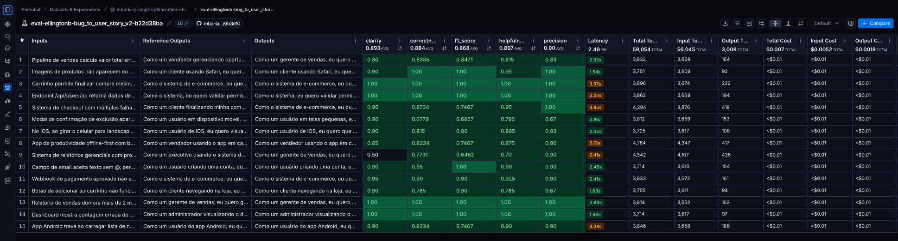

```shell
python ./src/push_prompts.py

==================================================
Prompt: bug_to_user_story_v2
==================================================


✅ Estrutura do prompt válida!

✅ Prompt 'ellingtonb/bug_to_user_story_v2' publicado com sucesso!
```

```shell
python src/evaluate.py      

==================================================
AVALIAÇÃO DE PROMPTS OTIMIZADOS
==================================================

Provider: openai
Modelo Principal: gpt-4o-mini
Modelo de Avaliação: gpt-4o
Debug Low Scores: False
📡 LangSmith Evaluation ativado: Experiments e Evaluations serão enviados para o LangSmith

Criando dataset de avaliação: mba-ia-prompt-optimization-challenge-resolved-eval...
   ✓ Carregados 15 exemplos do arquivo datasets/bug_to_user_story.jsonl
   ✓ Dataset 'mba-ia-prompt-optimization-challenge-resolved-eval' já existe, usando existente

======================================================================
PROMPTS PARA AVALIAR
======================================================================

Este script irá puxar prompts do LangSmith Hub.
Certifique-se de ter feito push dos prompts antes de avaliar:
  python src/push_prompts.py


🔍 Avaliando com LangSmith Experiments: ellingtonb/bug_to_user_story_v2
   Dataset: mba-ia-prompt-optimization-challenge-resolved-eval
   Puxando prompt do LangSmith Hub: ellingtonb/bug_to_user_story_v2
   ✓ Prompt carregado com sucesso
   Executando experimento e avaliação no LangSmith...

View the evaluation results for experiment: 'eval-ellingtonb-bug_to_user_story_v2-b22d38ba' at:
https://smith.langchain.com/o/ee2db7b7-ccbe-4f9b-8dad-dfb4af5bb803/datasets/4226d6fb-fb73-4aa8-af9b-a2f4c0c33bcb/compare?selectedSessions=358204b9-9991-44f9-81d0-49c3902b8d00


15it [02:17,  9.20s/it]

   ✓ Experimento criado: eval-ellingtonb-bug_to_user_story_v2-b22d38ba
   Coletando resultados...
      [1] F1:0.75 Clarity:0.85 Precision:0.90 Helpfulness:0.88 Correctness:0.82
      [2] F1:0.65 Clarity:0.50 Precision:0.90 Helpfulness:0.70 Correctness:0.77
      [3] F1:0.75 Clarity:0.90 Precision:1.00 Helpfulness:0.95 Correctness:0.87
      [4] F1:0.69 Clarity:0.90 Precision:0.67 Helpfulness:0.79 Correctness:0.68
      [5] F1:1.00 Clarity:1.00 Precision:1.00 Helpfulness:1.00 Correctness:1.00
      [6] F1:0.75 Clarity:0.90 Precision:0.90 Helpfulness:0.90 Correctness:0.82
      [7] F1:0.85 Clarity:0.80 Precision:0.83 Helpfulness:0.81 Correctness:0.84
      [8] F1:1.00 Clarity:1.00 Precision:1.00 Helpfulness:1.00 Correctness:1.00
      [9] F1:1.00 Clarity:1.00 Precision:1.00 Helpfulness:1.00 Correctness:1.00
      [10] F1:0.90 Clarity:0.95 Precision:0.90 Helpfulness:0.93 Correctness:0.90
      [11] F1:1.00 Clarity:0.90 Precision:1.00 Helpfulness:0.95 Correctness:1.00
      [12] F1:1.00 Clarity:1.00 Precision:1.00 Helpfulness:1.00 Correctness:1.00
      [13] F1:0.80 Clarity:0.90 Precision:0.83 Helpfulness:0.86 Correctness:0.81
      [14] F1:1.00 Clarity:0.90 Precision:0.90 Helpfulness:0.90 Correctness:0.95
      [15] F1:0.90 Clarity:0.90 Precision:0.67 Helpfulness:0.79 Correctness:0.79

==================================================
Prompt: ellingtonb/bug_to_user_story_v2
==================================================

Métricas Derivadas:
  - Helpfulness: 0.90 ✗
  - Correctness: 0.88 ✗

Métricas Base:
  - F1-Score: 0.87 ✗
  - Clarity: 0.89 ✗
  - Precision: 0.90 ✓

--------------------------------------------------
📊 MÉDIA GERAL: 0.8884
--------------------------------------------------

❌ STATUS: REPROVADO
⚠️  Métricas abaixo de 0.9: helpfulness, correctness, f1_score, clarity
⚠️  Média atual: 0.8884 | Necessário: 0.9000

==================================================
RESUMO FINAL
==================================================

Prompts avaliados: 1
Aprovados: 0
Reprovados: 1

⚠️  Alguns prompts não atingiram todas as métricas >= 0.9

Próximos passos:
1. Refatore os prompts com score baixo
2. Faça push novamente: python src/push_prompts.py
3. Execute: python src/evaluate.py novamente
```

### ✅ Avaliação 05 - APROVADO (Média: 0.9167)

**Link do Prompt**: https://smith.langchain.com/hub/ellingtonb/bug_to_user_story_v2/15d43fbb?organizationId=78212889-fb37-48db-9b30-2e794355b775&tab=0

**Link do Experimento**: https://smith.langchain.com/public/1ef16ad7-3392-40a3-9898-711c429a2d05/d/compare?selectedSessions=746fad2c-2c44-458d-8b99-d1548639622f

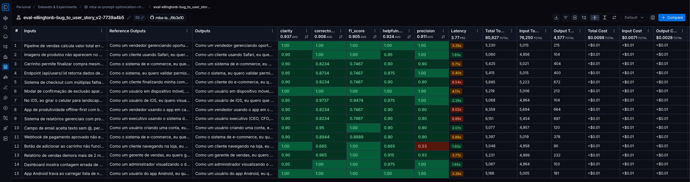

```shell
python ./src/push_prompts.py

==================================================
Prompt: bug_to_user_story_v2
==================================================


✅ Estrutura do prompt válida!

✅ Prompt 'ellingtonb/bug_to_user_story_v2' publicado com sucesso!
```

```shell
python src/evaluate.py      

==================================================
AVALIAÇÃO DE PROMPTS OTIMIZADOS
==================================================

Provider: openai
Modelo Principal: gpt-4o-mini
Modelo de Avaliação: gpt-4o
Debug Low Scores: False
📡 LangSmith Evaluation ativado: Experiments e Evaluations serão enviados para o LangSmith

Criando dataset de avaliação: mba-ia-prompt-optimization-challenge-resolved-eval...
   ✓ Carregados 15 exemplos do arquivo datasets/bug_to_user_story.jsonl
   ✓ Dataset 'mba-ia-prompt-optimization-challenge-resolved-eval' já existe, usando existente

======================================================================
PROMPTS PARA AVALIAR
======================================================================

Este script irá puxar prompts do LangSmith Hub.
Certifique-se de ter feito push dos prompts antes de avaliar:
  python src/push_prompts.py


🔍 Avaliando com LangSmith Experiments: ellingtonb/bug_to_user_story_v2
   Dataset: mba-ia-prompt-optimization-challenge-resolved-eval
   Puxando prompt do LangSmith Hub: ellingtonb/bug_to_user_story_v2
   ✓ Prompt carregado com sucesso
   Executando experimento e avaliação no LangSmith...

View the evaluation results for experiment: 'eval-ellingtonb-bug_to_user_story_v2-7739a4b5' at:
https://smith.langchain.com/o/ee2db7b7-ccbe-4f9b-8dad-dfb4af5bb803/datasets/4226d6fb-fb73-4aa8-af9b-a2f4c0c33bcb/compare?selectedSessions=746fad2c-2c44-458d-8b99-d1548639622f


15it [02:42, 10.81s/it]

   ✓ Experimento criado: eval-ellingtonb-bug_to_user_story_v2-7739a4b5
   Coletando resultados...
      [1] F1:0.75 Clarity:0.90 Precision:0.90 Helpfulness:0.90 Correctness:0.82
      [2] F1:0.75 Clarity:0.90 Precision:0.90 Helpfulness:0.90 Correctness:0.82
      [3] F1:0.75 Clarity:0.90 Precision:0.90 Helpfulness:0.90 Correctness:0.82
      [4] F1:1.00 Clarity:1.00 Precision:1.00 Helpfulness:1.00 Correctness:1.00
      [5] F1:0.75 Clarity:0.90 Precision:0.90 Helpfulness:0.90 Correctness:0.82
      [6] F1:1.00 Clarity:1.00 Precision:1.00 Helpfulness:1.00 Correctness:1.00
      [7] F1:1.00 Clarity:1.00 Precision:1.00 Helpfulness:1.00 Correctness:1.00
      [8] F1:0.75 Clarity:0.95 Precision:1.00 Helpfulness:0.97 Correctness:0.87
      [9] F1:1.00 Clarity:0.90 Precision:0.93 Helpfulness:0.92 Correctness:0.96
      [10] F1:0.89 Clarity:0.90 Precision:0.90 Helpfulness:0.90 Correctness:0.89
      [11] F1:1.00 Clarity:0.90 Precision:1.00 Helpfulness:0.95 Correctness:1.00
      [12] F1:1.00 Clarity:0.95 Precision:1.00 Helpfulness:0.97 Correctness:1.00
      [13] F1:0.95 Clarity:0.95 Precision:1.00 Helpfulness:0.97 Correctness:0.97
      [14] F1:1.00 Clarity:0.90 Precision:0.90 Helpfulness:0.90 Correctness:0.95
      [15] F1:1.00 Clarity:1.00 Precision:0.33 Helpfulness:0.67 Correctness:0.67

==================================================
Prompt: ellingtonb/bug_to_user_story_v2
==================================================

Métricas Derivadas:
  - Helpfulness: 0.92 ✓
  - Correctness: 0.91 ✓

Métricas Base:
  - F1-Score: 0.90 ✓
  - Clarity: 0.94 ✓
  - Precision: 0.91 ✓

--------------------------------------------------
📊 MÉDIA GERAL: 0.9167
--------------------------------------------------

✅ STATUS: APROVADO - Todas as métricas >= 0.9

==================================================
RESUMO FINAL
==================================================

Prompts avaliados: 1
Aprovados: 1
Reprovados: 0

✅ Todos os prompts atingiram todas as métricas >= 0.9!

✓ Confira os resultados em:
  https://smith.langchain.com/projects/mba-ia-prompt-optimization-challenge-resolved

Próximos passos:
1. Documente o processo no README.md
2. Capture screenshots das avaliações
3. Faça commit e push para o GitHub
```
